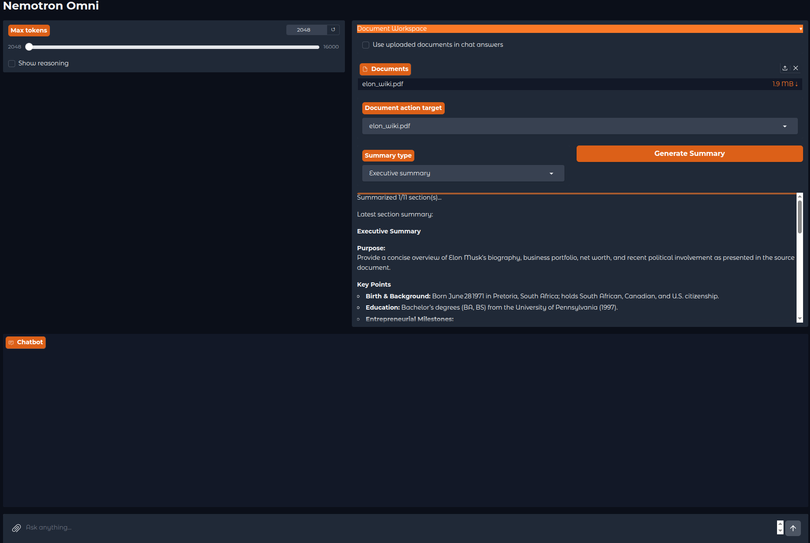

# Nemotron Omni Chat

A multimodal conversational AI system built with:
- **Backend**: Modal vLLM API running Nemotron model
- **Frontend**: Gradio UI for local chat interface
- **Inference**: GPU-accelerated with L40S (Or any GPU we launch the Modal server with)



## Architecture

```
Gradio UI (local)
    ↓
Modal vLLM API
    ↓
Nemotron NVFP4
```

## Project Structure

```
├── backend
│   ├── app.py
│   └── .env.example
├── frontend
│   ├── app.py
│   ├── chat_service.py
│   ├── config.py
│   ├── .env.example
│   ├── messages.py
│   ├── rag.py
│   ├── requirements.txt
│   ├── responses.py
│   └── theme.py
├── .gitignore
├── LICENSE
├── README.md
└── requirements.txt
```

## Setup Instructions

### Backend Setup

* Create virtual environment:

```bash
cd backend
python3 -m venv venv
source venv/bin/activate
```

* Install dependencies:

```bash
pip install -r requirements.txt
```

* Setup Modal:

```bash
modal setup
```

* Create a `.env` and fill the application name:

```
APP_NAME="YOUR_APP_NAME_HERE"
```

* Create Hugging Face token at [HF Tokens](https://huggingface.co/settings/tokens)

* Save HF token in Modal:

```bash
modal secret create hf-secret \
HF_TOKEN=YOUR_HF_TOKEN
```

* Deploy backend:

```bash
modal deploy app.py
```

* Save the endpoint URL provided (format: `https://YOUR-NAME--nemotron-omni-serve.modal.run`)

* Test backend:

```bash
curl https://YOUR-NAME--YOUR-APP-NAME.modal.run/v1
```

In the above, `YOUR-NAME` is the modal workspace name, and `YOUR-APP-NAME` is the application that you have given in the `backend/.env` file.

### Frontend Setup

1. Create virtual environment:
```bash
cd frontend
python3 -m venv venv
source venv/bin/activate
```

2. Install dependencies:
```bash
pip install -r requirements.txt
```

3. Update `.env` with your Modal endpoint:
```env
API_BASE_URL=https://YOUR-NAME--YOUR-APP-NAME.modal.run/v1
```

4. Run frontend:
```bash
python app.py
```

5. Open browser to the provided URL (typically http://localhost:7860)

## Features

- **Multimodal Support**: Images, videos, audio, and text
- **Conversation History**: In-memory history per session
- **RAG Support**: Supports RAG via ChromaDB
- **Document Summarization Support**: A different workflow to summarize large documents
- **Local UI**: Gradio interface running locally
- **GPU Inference**: Cloud GPU acceleration via Modal
- **OpenAI-compatible API**: Uses OpenAI client library

## Supported File Types

- Images: `.png`, `.jpg`, `.jpeg`
- Videos: `.mp4`
- Audio: `.mp3`, `.wav`
- Text: Plain text input
- `.pdf`, `.docx`, and `.txt` for RAG
